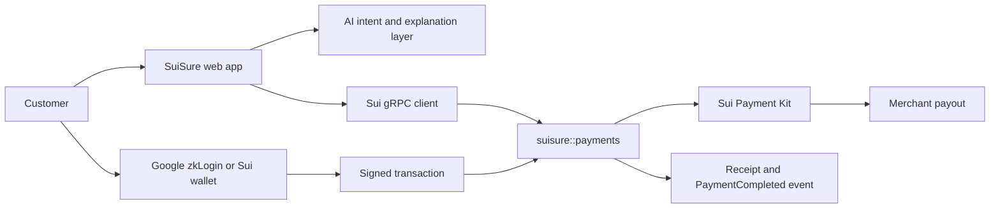

# SuiSure — MUBA Blockchain Hackathon 2026

### **SuiSure: U SURE OR NOT???**

> AI-assisted, on-chain merchant payments that verify the merchant, amount, token, expiry, and replay status before money moves.

**Tracks:** Track 1 — Payments & Stablecoins · Track 2 — AI × Sui  
**Network:** Sui Testnet  
**Live app:** https://suisure--suisure-cuties.asia-southeast1.hosted.app  
**Demo video:** _Add submission link_

---

## 1. Problem and proposed solution

Crypto merchant checkout still asks ordinary users to trust opaque wallet addresses and client-supplied QR data. A replaced QR can redirect an irreversible payment, a reused request can be replayed, and an amount-only check can accept the wrong token.

SuiSure replaces “scan and hope” with “scan, verify, then pay”:

- A merchant receives an on-chain `MerchantCredential`.
- Each checkout is represented by an on-chain `PaymentIntent`.
- The QR contains object identifiers—not a destination wallet address.
- SuiSure reads the canonical merchant, amount, coin type, expiry, and payment status from Sui.
- The customer reviews and confirms the transaction using Google zkLogin or a Sui wallet.
- Funds settle directly from customer to merchant in Testnet USDC, and the customer receives an on-chain receipt.

SuiSure borrows the familiar experience of merchant QR payments; it does **not** integrate with or replace DuitNow.

## 2. How SuiSure works

1. **Register merchant** — an administrator issues a shared `MerchantCredential` containing the merchant name, category, payout address, and active status.
2. **Create request** — a payment intent fixes the merchant credential, amount, display amount in MYR, token type, description, order reference, nonce, and expiry.
3. **Scan or ask** — the customer scans/uploads a SuiSure QR or describes the intended payment in plain language.
4. **Verify on Sui** — the app loads the objects from Testnet and rejects mismatched, inactive, expired, paid, or wrong-token requests.
5. **Human confirmation** — AI may interpret or explain; it cannot sign or submit.
6. **Settle and prove** — Sui Payment Kit moves the coin wallet-to-wallet, the intent is marked paid, an event is emitted, and a `SuiSureReceipt` is transferred to the payer.

### Key features

- Google zkLogin and Sui Wallet Standard sign-in
- QR scan, image upload, and plain-language payment entry
- Verified merchant and canonical on-chain payment review
- Direct Testnet USDC settlement with no SuiSure custody
- Replay, expiry, merchant-substitution, and wrong-coin protection
- Customer receipts plus sender/recipient-scoped activity and notifications
- Merchant payment-request dashboard with QR generation and status refresh
- Explorer links for independently verifiable transactions

## 3. Why Sui is integral

Sui is the trust layer, not a database added after the fact. Shared objects let customers read merchant credentials and payment requests created by another party. Move enforces the payment rules atomically. Sui events and owned receipt objects provide independently verifiable outcomes.

**Sui Payment Kit is the cashier; `suisure::payments` is the security guard.** Payment Kit validates the amount, blocks duplicate registry payments, transfers funds, and emits its receipt. SuiSure adds merchant identity, canonical payout resolution, token binding, expiry, readable failure states, and a customer-owned receipt.

| Track | Alignment |
| --- | --- |
| **Track 1 — Payments & Stablecoins** | Real wallet-to-wallet Testnet USDC checkout through Sui Payment Kit, with merchant credentials, expiring payment requests, replay protection, and receipts. |
| **Track 2 — AI × Sui** | Natural-language assistance helps users understand and prepare payments, while verified Sui objects—not model output—remain the source of truth. The AI cannot supply a trusted payout address or sign a transaction. |

## 4. Architecture



### Technology stack

| Layer | Technology |
| --- | --- |
| Frontend | React 19, TanStack Start/Router, TypeScript, Vite, Tailwind CSS |
| Sui client | `@mysten/sui` v2 gRPC, `@mysten/dapp-kit-react` |
| Authentication | Enoki Google zkLogin and Sui Wallet Standard |
| Smart contracts | Sui Move 2024, `suisure::payments` |
| Payments | Sui Payment Kit, Circle Testnet USDC |
| QR | `qrcode`, ZXing browser scanner |
| Hosting | Firebase App Hosting |

## 5. Smart contracts, Payment Kit, and safety boundaries

The QR schema accepts a payment-intent ID and merchant-credential ID. It never accepts a payout address. During payment, `pay_payment_intent<T>`:

1. requires an active merchant;
2. binds the intent to the correct credential;
3. binds the request to the correct coin type;
4. rejects expired requests;
5. rejects already-paid requests;
6. reads the payout address from the credential;
7. calls `payment_kit::process_registry_payment<T>`;
8. marks the intent paid, emits `PaymentCompleted`, and gives the payer a receipt.

The Payment Kit registry uses `registry_managed_funds = false`, so SuiSure never holds customer or merchant funds.

### AI safety boundary

The AI layer may parse a message, identify missing information, suggest verified merchant candidates, and explain what will happen. It must never:

- return a payout address as trusted truth;
- override the on-chain amount, token, merchant, or expiry;
- sign, approve, or submit a transaction;
- expose another account's activity or notifications.

## 6. Sui Testnet deployment

### Packages and shared objects

| Resource | ID |
| --- | --- |
| SuiSure package | `0xac4bbcadef19c4687a75bda3afa31e069473e8824d43d771f7c5c36fee1dd445` |
| PaymentRegistry | `0x3291fba65f6b24c4790727042b7198be9b0be43e3b88694a330cd4ad644e1691` |
| Payment Kit package | `0x7e069abe383e80d32f2aec17b3793da82aabc8c2edf84abbf68dd7b719e71497` |
| Payment Kit Namespace | `0xa5016862fdccba7cc576b56cc5a391eda6775200aaa03a6b3c97d512312878db` |
| Testnet USDC type | `0xa1ec7fc00a6f40db9693ad1415d0c193ad3906494428cf252621037bd7117e29::usdc::USDC` |

Administrative capabilities are intentionally omitted from this public quick-reference table. Full deployment constants remain in `src/config/sui.ts`.

### Verified Testnet transactions

| Scenario | Transaction | Result |
| --- | --- | --- |
| Successful payment | [`FhtaB57t…3oQcw`](https://suiscan.xyz/testnet/tx/FhtaB57tHhv5nrxKhQP4o1miyjhykFLYKDD6BCP3oQcw) | 2.553191 USDC delivered |
| Replayed request | [`6Fp4Rd3v…b1icP`](https://suiscan.xyz/testnet/tx/6Fp4Rd3vckbRSpyrz9rMPwer4d2jCWtFHvMyLxRb1icP) | Rejected: already paid |
| Swapped credential | [`AkzDNewd…LFXXT`](https://suiscan.xyz/testnet/tx/AkzDNewdTdKko3rxB3MiZR8KYBjUcRFWHnTGqbcLFXXT) | Rejected: merchant mismatch |
| Wrong coin type | [`ABYL1hs4…U4fHr`](https://suiscan.xyz/testnet/tx/ABYL1hs4ThwTsYsWr7qZ613t4gp8oCni3qebUPVU4fHr) | Rejected: coin mismatch |

## 7. Run locally

### Prerequisites

- Node.js 22 or newer
- npm
- Sui CLI for Move build/test
- A Sui Testnet account with SUI for gas
- Testnet USDC for payment testing
- Enoki project and Google OAuth web client for zkLogin

### Installation

```bash
git clone https://github.com/fieqah-faisal/SuiSure-MUBA2026-Cuties.git
cd SuiSure-MUBA2026-Cuties
npm install
```

Create `.env.local` in the project root:

```dotenv
VITE_ENOKI_API_KEY=your_enoki_public_api_key
VITE_GOOGLE_CLIENT_ID=your_google_oauth_client_id
```

These are browser-side public configuration values. Do not place private keys, admin capability secrets, wallet mnemonics, or server credentials in `VITE_*` variables.

Run the app:

```bash
npm run dev
```

Production build and local preview:

```bash
npm run build
npm run preview
```

The preview command runs the generated TanStack/Nitro server from `.output/server/index.mjs`.

## 8. Testing

```bash
npm run lint
npm run build

cd move
sui move build
sui move test
```

The Move suite contains eight tests, including five expected-failure cases. Before a release, also test both Google zkLogin and an extension wallet:

- sign in and verify the displayed address/balances;
- open a valid QR and confirm the merchant, amount, token, and expiry;
- complete a Testnet USDC payment and open its explorer link;
- verify payer and merchant activity/notifications are account-scoped;
- retry the same intent and confirm replay rejection;
- open an expired intent and confirm no transaction can be submitted;
- sign out/disconnect and confirm protected state is cleared.

## 9. Security model, limitations, and roadmap

### Security model

- The payout address comes only from the on-chain merchant credential.
- Canonical on-chain state overrides QR, URL, and AI-provided text.
- Coin type and smallest-unit precision are explicit; Testnet USDC uses six decimals.
- Transactions require the current user's wallet or zkLogin signer.
- Funds move directly to the merchant; SuiSure is non-custodial.
- Activity and notifications are filtered to the connected account.

### Current limitations

- Testnet prototype only; no real-money or licensed payment service.
- Merchant credentials are administrator-issued.
- Testnet USDC/MYR display conversion is a demo configuration, not a live FX quote.
- Google zkLogin is the current social provider; Apple and Facebook are not enabled.
- The AI layer assists interpretation and explanation but never authorizes payment.

### Future integrations

- Merchant self-service application and administrator approval workflow
- Additional zkLogin providers
- Production-grade pricing/oracle integration
- More stablecoins and merchant settlement preferences
- Richer receipts, refunds, and merchant reconciliation
- Model-backed multilingual assistance with the same deterministic safety boundary

## 10. Team, AI declaration, and license

| Member | Responsibility |
| --- | --- |
| **Aida** | Move contract, Sui Payment Kit integration, Testnet deployment, Sui transaction adapter |
| **Aidan** | AI endpoint, structured intent output, merchant resolution, validation |
| **Syafieqah** | Wallet and zkLogin integration, live Sui frontend flows, QR/review/receipt UI, Firebase deployment |

### AI tools declaration

AI tools were used during development for implementation support, review, debugging, and documentation. The team must list the exact tools/models used in the final hackathon submission. AI-generated suggestions were reviewed and tested by team members; on-chain transactions remain user-authorized.

### License

This repository is a hackathon prototype. No open-source license has been granted unless a `LICENSE` file is added.

---

**Before you pay, SuiSure asks: “U sure or not?”**
